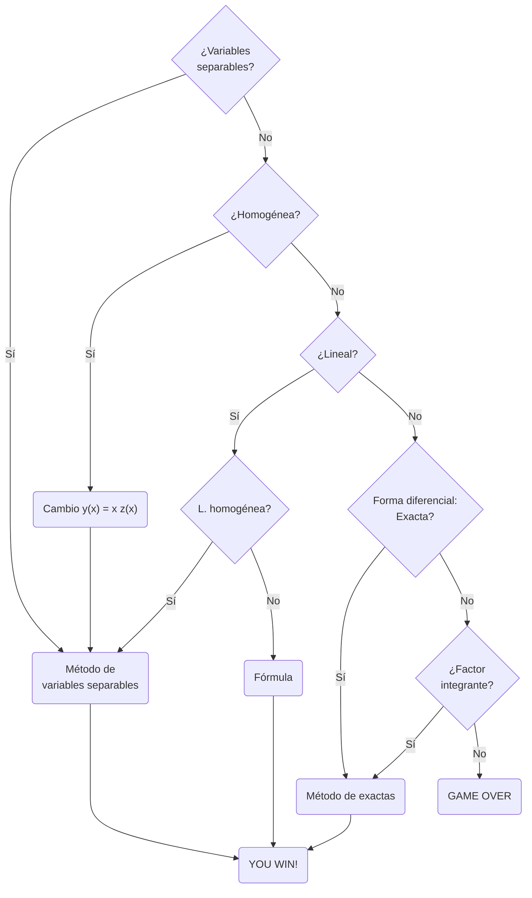

---
{"dg-publish":true,"permalink":"/mat-ii-qui/apuntes/tema-5-ecuaciones-diferenciales-ordinarias-de-primer-orden/","updated":"2025-09-15T10:05:23.236+02:00"}
---

[[MatII-Qui/Matemáticas II- Química- Índice\|Volver al temario]].
# Tema 5. Ecuaciones diferenciales ordinarias de primer orden.
- [[MatII-Qui/Apuntes/Tema 5. Ecuaciones diferenciales ordinarias de primer orden#Introducción\|Introducción]]
- [[MatII-Qui/Apuntes/Tema 5. Ecuaciones diferenciales ordinarias de primer orden#Definiciones\|Definiciones]]
	- [[MatII-Qui/Apuntes/Tema 5. Ecuaciones diferenciales ordinarias de primer orden#Definiciones\|Problema de Valores Iniciales]]
	- [[MatII-Qui/Apuntes/Tema 5. Ecuaciones diferenciales ordinarias de primer orden#Definiciones\|Interpretación geométrica]]
- [[MatII-Qui/Apuntes/Tema 5. Ecuaciones diferenciales ordinarias de primer orden#Resolución de EDOs de Primer Orden\|Resolución de EDOs de Primer Orden]]
	- [[MatII-Qui/Apuntes/Tema 5. Ecuaciones diferenciales ordinarias de primer orden#Resolución de EDOs de Primer Orden\|Ecuaciones de Variables Separables]]
	- [[MatII-Qui/Apuntes/Tema 5. Ecuaciones diferenciales ordinarias de primer orden#Resolución de EDOs de Primer Orden\|Ecuaciones Homogéneas]]
	- [[MatII-Qui/Apuntes/Tema 5. Ecuaciones diferenciales ordinarias de primer orden#Resolución de EDOs de Primer Orden\|Ecuaciones Lineales]]
	- [[MatII-Qui/Apuntes/Tema 5. Ecuaciones diferenciales ordinarias de primer orden#Resolución de EDOs de Primer Orden\|Ecuaciones Exactas]]
	- [[MatII-Qui/Apuntes/Tema 5. Ecuaciones diferenciales ordinarias de primer orden#Resolución de EDOs de Primer Orden\|Factor Integrante]]
- [[MatII-Qui/Apuntes/Tema 5. Ecuaciones diferenciales ordinarias de primer orden#Diagrama de flujo\|Diagrama de flujo]]
- [[MatII-Qui/Apuntes/Tema 5. Ecuaciones diferenciales ordinarias de primer orden#Aplicaciones y Modelización\|Aplicaciones y Modelización]]
	- [[MatII-Qui/Apuntes/Tema 5. Ecuaciones diferenciales ordinarias de primer orden#Aplicaciones y Modelización\|Desintegración Radiactiva]]
	- [[MatII-Qui/Apuntes/Tema 5. Ecuaciones diferenciales ordinarias de primer orden#Aplicaciones y Modelización\|Cinética de reacciones químicas]]
	- [[MatII-Qui/Apuntes/Tema 5. Ecuaciones diferenciales ordinarias de primer orden#Aplicaciones y Modelización\|Ley de Enfriamiento de Newton]]
	- [[MatII-Qui/Apuntes/Tema 5. Ecuaciones diferenciales ordinarias de primer orden#Aplicaciones y Modelización\|Mezclas de sustancia]]
	- [[MatII-Qui/Apuntes/Tema 5. Ecuaciones diferenciales ordinarias de primer orden#Aplicaciones y Modelización\|Mezcla térmica]]

## Introducción
En ciencia suele ocurrir que las magnitudes que nos interesan no son directamente "accesibles", pero sí somos capaces de encontrar relaciones entre ellas y sus derivadas. Ejemplo base: una población de cualquier ser vivo crece, al principio, de manera proporcional al tamaño de la población: cuantos más individuos hay, mayor descendencia tienen. Esto nos lleva a plantear la ecuación:
$$
P'(t)=kP(t).
$$
Veremos cómo resolverla.
Otro ejemplo: la temperatura a la que se enfría un cuerpo depende de la diferencia de temperatura con el medio:
$$
T'(t)=k (T_{amb}-T(t)).
$$
## Definiciones

Una **ecuación diferencial (ED)** es una ecuación que relaciona una función incógnita con algunas de sus derivadas.
- **Ecuaciones Diferenciales Ordinarias (EDO)**: cuando la función incógnita depende de una sola variable.
- **Ecuaciones en Derivadas Parciales (EDP)**: cuando la función incógnita depende de varias variables.

El **orden** de una ecuación diferencial es el mayor orden de las derivadas que aparecen en la ecuación.
Ejemplos:
- **Primer orden**: $y' = \sin y$
- **Orden superior**: $y'' + y' - y = 0$

**Forma diferencial**. Una EDO de primer orden se puede poner en forma diferencial sustituyendo $y'$ por $\frac{dy}{dx}$ y "pasando multiplicando":
$$
y' = \sin y \implies \sin(y) dx-dy=0
$$

Una solución de una ecuación diferencial es una función $f(x)$ definida en un intervalo $I$ tal que al sustituirla en la ecuación se verifica la igualdad. Distinguimos entre soluciones **explícitas** e **implícitas**:
- **Explícita**: $y = f(x)$
	Ejemplo: $y' = 2x \implies y = x^2$. Comprobamos derivando y sustituyendo

- **Implícita**: $F(x, y) = 0$
	Ejemplo: $y' = -x/y \implies y^2 + x^2 = 1$. Para comprobarlo, derivamos (usando la regla de la cadena) y obtenemos:
	$$
	2yy'+2x=0,
	$$
	y entonces
	$$
	y'=-x/y.
	$$
	que coincide con nuestra EDO.
	Si nos hubiesen dado la EDO en forma diferencial $ydy+xdx=0$ podríamos obtener una forma diferencial a partir de la solución implícita:
	$$
	2ydy+2xdx=0,
	$$
	que coincide con la de la EDO salvo por un múltiplo.

Llamamos solución general a una familia de funciones dependientes de un parámetro arbitrario $C$.  Solución singular: no se obtiene de la general.

Ejemplos:
 - $y' = 2x \implies y = x^2+C$
 - $y' = -y/x \implies y^2 + x^2 = C$

### Problema de Valores Iniciales
El problema de valores iniciales (PVI) o problema de Cauchy se define como:
$$ 
\begin{cases} y' = F(x, y) \\ y(x_0) = y_0 \end{cases} 
$$
Solución particular: valor concreto de $C$ en la solución general.

**Teorema de Existencia y Unicidad**. 
Si $F(x, y)$ y su derivada parcial $\frac{\partial F}{\partial y}$ son continuas en una región $R$, entonces existe una única solución en un intervalo $I$ que satisface la ecuación diferencial y la condición inicial.

### Interpretación geométrica
Una ecuación diferencial de primer orden de la forma  
$$
y' = F(x, y)
$$
se puede interpretar como un campo de direcciones en $\mathbb{R}^2$. En cada punto $(x, y)$, la ecuación define la pendiente de una recta tangente. Al dibujar estas direcciones en varios puntos, obtenemos un campo de direcciones, que nos da una idea visual del comportamiento de las soluciones.
![[Pasted image 20250330094204.png\|Pasted image 20250330094204.png]]
Las soluciones de la ecuación son curvas cuya derivada en cada punto coincide con la dirección del campo. Es decir, son trayectorias tangentes a los vectores del campo de direcciones (curvas negras de la siguiente imagen). Cuando se impone una condición inicial $y(x_0) = y_0$, es decir, un PVI, se selecciona una única curva de solución que pasa por $(x_0, y_0)$ (la curva roja).
![[Pasted image 20250330094315.png\|Pasted image 20250330094315.png]]

## Resolución de EDOs de Primer Orden

### Ecuaciones de Variables Separables
Si la ecuación se puede escribir como:
$$ y' = a(x)b(y) $$
Se separan las variables y se integran ambos lados:
$$ \int \frac{1}{b(y)} dy = \int a(x) dx $$

**Ejemplo**: Resolver $y' = x(y - 2)$.

**Ejemplo**: Resolver el problema de valor inicial
$$
\begin{cases} y' = 2x(y - 2) \\ y(0) = 1 \end{cases}
$$

### Ecuaciones Homogéneas
Una ecuación es homogénea si:
$$ f(tx, ty) = f(x, y) $$
Mediante el cambio de variable $y(x) = x z(x)$, la ecuación queda transformada en una de variables separables.

**Ejemplo**: Resolver $y' = \frac{y - x}{y + x}$.
En primer lugar, comprobamos que es homogénea:
$$
f(tx,ty)=\frac{ty-tx}{ty+tx}=\frac{t(y-x)}{t(y+x)}=\frac{y-x}{y+x}=f(x,y)
$$
Por lo que es homogénea. Por tanto, hacemos el cambio de variable:
$$ y = xz, \quad y' = z + x z', $$
sustituimos en la ecuación:
$$ z + x z' = \frac{xz - x}{xz + x} = \frac{x(z - 1)}{x(z + 1)} = \frac{z - 1}{z + 1}, $$
$$ x z' = \frac{z - 1}{z + 1} - z = \frac{z - 1 - z(z + 1)}{z + 1} = \frac{z - 1 - z^2 - z}{z + 1} = \frac{-z^2 - 1}{z + 1}. $$

$$ x z' = \frac{-z^2 - 1}{z + 1}, $$
$$ \frac{z + 1}{-z^2 - 1} dz = \frac{1}{x} dx, $$
$$ -\frac{z + 1}{z^2 + 1} dz = \frac{1}{x} dx, $$
integramos ambos lados:
$$ \int \frac{z + 1}{z^2 + 1} dz = -\int \frac{1}{x} dx, $$
$$ \int \frac{z}{z^2 + 1} dz + \int \frac{1}{z^2 + 1} dz = -\ln|x| + C, $$
$$ \frac{1}{2} \ln(z^2 + 1) + \arctan(z) = -\ln|x| + C. $$

Deshacer el cambio
$$ z = \frac{y}{x}, $$
$$ \frac{1}{2} \ln\left(\frac{y^2}{x^2} + 1\right) + \arctan\left(\frac{y}{x}\right) = -\ln|x| + C. $$

### Ecuaciones Lineales
De la forma:
$$ y' + P(x)y = Q(x) $$
**Si homogénea**, i.e., $Q(x)=0$, entonces es de variables separables. 
**Ejemplo**: $y'+\cos(x)y=0$.

**Si no homogénea**, derivada de un producto:
**Ejemplo motivador**: Resolver $y' + 2xy = x$.
Nos damos cuenta de que si multiplicamos ambos miembros por $\mu$
$$
\mu y' + 2x \mu y = \mu x
$$
en la parte izquierda tenemos casi la derivada de un producto. Para que sea $\mu y' + 2x \mu y=(\mu y)'$ debe ser:
$$
\mu' = \mu 2x
$$
y entonces:
$$
\frac{d\mu}{\mu} = 2x \,dx
$$
Integrando:
$$
\ln(\mu) = x^2 \implies \mu = e^{x^2}
$$

Sustituyendo
$$
(e^{x^2} y)' = e^{x^2}x
$$
Integrando ambos lados:
$$
e^{x^2} y = \int e^{x^2} x \,dx + C
$$
Y finalmente
$$
y = e^{-x^2} \left( \frac{1}{2} e^{x^2} + C \right)
$$
$$
y = \frac{1}{2} + C e^{-x^2}
$$

En la práctica usaremos **la fórmula**:
$$
\boxed{
y(x) = e^{-\int P(x)dx} \left( \int Q(x)e^{\int P(x)dx}dx + C \right) }
$$
o más troceada:
$$
\mu=\int Pdx
$$
$$
I=\int Qe^\mu dx
$$
$$
\boxed{
y=e^{-\mu}(I+C).}
$$

**Ejemplo**
Consideremos el PVI:
$$
y' + 2y = e^x
$$
$$
y(0) = 1.
$$
Identificamos:
- $P(x) = 2$
- $Q(x) = e^x$

La solución general viene dada por:
$$
y(x) = e^{-\int P(x)dx} \left( \int Q(x)e^{\int P(x)dx}dx + C \right)
$$

1. **Calculamos**  
   $$
   e^{\int P(x)dx} = e^{\int 2dx} = e^{2x}
   $$
2. **Cálculo de la integral**  
   $$
   \int Q(x)e^{\int P(x)dx}dx = \int e^x e^{2x} dx = \int e^{3x}dx
   $$

   Resolviendo la integral:
   $$
   \int e^{3x}dx = \frac{e^{3x}}{3}
   $$

3. **Expresión de la solución general**  
   $$
   y(x) = e^{-2x} \left( \frac{e^{3x}}{3} + C \right)
   $$
   $$
   y(x) = \frac{e^{x}}{3} + Ce^{-2x}
   $$

4. **Aplicación de la condición inicial $y(0) = 1$**  
   $$
   1 = \frac{e^0}{3} + C e^0
   $$
   $$
   1 = \frac{1}{3} + C
   $$
   $$
   C = \frac{2}{3}
   $$

5. **Solución particular**  
   $$
   y(x) = \frac{e^x}{3} + \frac{2}{3}e^{-2x}
   $$
---

### Ecuaciones Exactas
La escribimos en forma diferencial:
$$ 
M(x, y)dx + N(x, y)dy = 0 .
$$
Decimos que es exacta si
$$
\frac{\partial M}{\partial y} = \frac{\partial N}{\partial x} \tag{1} %\label{cond_exacta}
$$
Para resolverla, buscamos una solución implícita general $F(x,y)=C$, que debe cumplir que
$$
\frac{\partial F}{\partial x}+\frac{\partial F}{\partial y}y'=0,
$$
$$
\frac{\partial F}{\partial x}dx+\frac{\partial F}{\partial y}dy=0,
$$
luego podemos probar con una $F$ que cumpla
$$
\frac{\partial F}{\partial x}=M.
$$
Así pues tendríamos que $F=\int M dx + K(y)$. Observa que la constante de integración $K$ puede depender de $y$, pues estamos integrando respecto de $x$. Por otra parte, como debería ser $\frac{\partial F}{\partial y}=N$ se tiene que
$$
\int \frac{\partial M}{\partial y} dx + K'(y)=N
$$
y de aquí podemos obtener $K$, integrando en:
$$
K'(y)=N-\int \frac{\partial M}{\partial y} dx
$$
pues gracias a $(1)$ tenemos asegurado que $N-\int \frac{\partial M}{\partial y} dx$ no depende de $x$.

**Ejemplo**
Consideremos la ecuación diferencial:
$$
(2xy + 3)dx + (x^2 + 4y)dy = 0
$$
Calculamos las derivadas parciales:
$$
\frac{\partial M}{\partial y} = \frac{\partial}{\partial y} (2xy + 3) = 2x.
$$
$$
\frac{\partial N}{\partial x} = \frac{\partial}{\partial x} (x^2 + 4y) = 2x.
$$
Sabemos que una solución $F(x, y)$ debe satisfacer:
$$
\frac{\partial F}{\partial x} = M = 2xy + 3.
$$
Integramos respecto a $x$:
$$
F(x, y) = \int (2xy + 3)dx = x^2y + 3x + K(y),
$$
donde $K(y)$ es una función de $y$ que debemos determinar.
Ahora usamos:
$$
x^2 + K'(y) = x^2 + 4y.
$$
De aquí, $K'(y) = 4y$, y al integrar:
$$
K(y) = 2y^2 + C.
$$
Por lo tanto, la solución implícita es:
$$
F(x, y) = x^2y + 3x + 2y^2 = C.
$$

### Factor Integrante
Si la ecuación no es exacta, se busca una función $\mu(x, y)$ tal que multiplicando la ecuación se convierta en exacta.
Se dice que una función $\mu(x, y)$ es un factor integrante de una EDO de primer orden si al multiplicar $\mu$ por ambos miembros de la EDO, ésta se convierte en exacta.  

**Ejemplo:**  
Comprobar que $\mu(x, y)=y^3$ es un factor integrante de la ecuación:  
$$
x y \, dx + (2x^2 + 3y^2 - 20) \, dy = 0
$$
Para una EDO escrita en la forma:
$$
M \, dx + N \, dy = 0
$$
obtenemos un factor integrante dependiente de $x$ o de $y$, "si tenemos suerte".

**Ejemplo 0:**
Veamos cómo obtener el factor integrante para
$$
x y \, dx + (2x^2 + 3y^2 - 20) \, dy = 0
$$
- Suponemos $\mu = \mu(x)$
$\mu(x) x \, dx + \mu(x) (x^2 + 3y - 20) \, dy = 0$

$\underbrace{\mu(x) x}_{M} \, dx + \underbrace{\mu(x) (x^2 + 3y - 20)}_{N} \, dy = 0$

$\frac{\partial M}{\partial y} = \mu(x) \cdot x$

$\frac{\partial N}{\partial x} = \mu'(x) (x^2 + 3y - 20) + \mu(x) 4x$

$\Rightarrow \frac{\mu'}{\mu}$ depende de $y$

- Suponemos $\mu = \mu(y)$
$\mu(y) x \, dx + \mu(y) (x^2 + 3y - 20) \, dy = 0$

$\underbrace{\mu(y) x}_{M} \, dx + \underbrace{\mu(y) (x^2 + 3y - 20)}_{N} \, dy = 0$

$\frac{\partial M}{\partial y} = x (\mu'(y) + \mu(y))$

$\frac{\partial N}{\partial x} = 4x \mu(y)$

$\Rightarrow x (\mu'(y) + \mu(y)) = 4x \mu(y)$

$\mu'y + \mu = 4\mu$ 

$\mu'y = 3\mu$ 

$\frac{\mu'}{\mu} = \frac{3}{y}$ $ln(\mu) = 3ln(y)$ 

$\mu = y^3$

**Ejemplo 1:**  
Encontrar un factor integrante para la ecuación:
$$
y' = y + x
$$
**Ejemplo 2:**  
Comprobar si la EDO:
$$
(1 + y) \, dx + (1 - x) \, dy = 0
$$
es exacta y, en caso de no serlo, encontrar un factor integrante.

## Diagrama de flujo
Dada una ode $y'=f(x,y)$, podemos seguir el siguiente diagrama de flujo:

## Aplicaciones y Modelización

### Desintegración Radiactiva
Muchos elementos radiactivos se desintegran con una tasa de desintegración proporcional a la cantidad de sustancia presente en el medio. Si $X$ denota a la sustancia y $Q(t)$ a la cantidad presente en el instante $t$, entonces la tasa de cambio de $Q(t)$ con respecto a $t$ está dada por:
$$
Q'(t) = -rQ(t),
$$
donde $r > 0$ depende del elemento $X$.
La solución es
$$
Q(t) = C e^{-r (t - t_0)}.
$$
Para determinar $C$ y $r$ se usa una medición de la cantidad de materia en un instante concreto: en el instante $t_0$ hay $Q_0$ cantidad de materia, y también con un valor experimental conocido como la **semivida** del elemento $X$, que es el tiempo necesario para que la cantidad de sustancia se reduzca a la mitad y se denota por $T_X$. Así pues para determinar completamente el modelo, se usa que
$$
Q(t_0)=Q_0
$$
y
$$
Q(t_0+T_X)=Q_0/2.
$$
**Ejemplo 1:** Los arqueólogos usaron trozos de madera quemada encontrados en unas cuevas para fechar las pinturas prehistóricas de las paredes. Determinar la edad de la madera si se encontró que había desaparecido el 85.5% de C-14, sabiendo que la vida media del C-14 es de 5730 años.

**Ejemplo 2:** Un reactor convierte el uranio-238, relativamente estable, en plutonio-239, un isótopo radiactivo. Al cabo de 15 años, se ha desintegrado el 0.043% de la cantidad inicial de una muestra de plutonio. Calcular la semivida del isótopo.

### Cinética de reacciones químicas
En muchas reacciones químicas, la velocidad de formación de un producto es proporcional a las cantidades restantes de los reactivos. Si dos sustancias, A y B, se combinan para formar una tercera sustancia C, la rapidez o velocidad de reacción es proporcional al producto de las cantidades de A y B que no han reaccionado aún.

Matemáticamente, si $A(t)$ y $B(t)$ representan las cantidades de A y B en el tiempo $t$, y la reacción sigue una ley de velocidad de segundo orden:
$$
\frac{da}{dt} = k (A_0 -  a C)(B_0 - b C),
$$
donde $A_0$ y $B_0$ son las cantidades iniciales de A y B, respectivamente, $a$ y $b$ reflejan la estequiometría de la reacción, y $k$ es una constante de proporcionalidad.

**Ejemplo**
3 g de A junto con 5 g de B dan lugar a 2 g de C y 6 g de D. Inicialmente tenemos 80g de A y 120 g de B. Si la formación de C es proporcional a la cantidad de reactivos que queda, calcula el modelo e cantidad de C en función del tiempo, sabiendo que al minuto de comenzar la reacción se ha producido 5 g de C.

**Reacción química (en proporciones):**  
$3g \, A + 5g \, B \rightarrow 2g \, C + 6g \, D$

**Cantidades iniciales:**  
- $A_0 = 80g$  
- $B_0 = 120g$

La **formación de $C$** es **proporcional a la cantidad de reactivos que queda**, es decir:  
$$
\frac{dC}{dt} = k \cdot A(t) \cdot B(t)
$$

A medida que se forma $C$, se consumen 3g de $A$ y 5g de $B$ por cada 2g de $C$.  
Entonces, si se han formado $C(t)$ gramos de producto:
- Se han consumido $\frac{3}{2} C(t)$ gramos de $A$
- Se han consumido $\frac{5}{2} C(t)$ gramos de $B$
Por lo tanto:
$$
A(t) = 80 - \frac{3}{2} C(t)
$$
$$
B(t) = 120 - \frac{5}{2} C(t)
$$

$$
\frac{dC}{dt} = k \cdot \left(80 - \frac{3}{2} C\right) \cdot \left(120 - \frac{5}{2} C\right)
$$

**Separación de variables**
Llevamos todos los términos de $C$ a un lado y los de $t$ al otro:

$$
\frac{dC}{\left(80 - \frac{3}{2} C\right) \cdot \left(120 - \frac{5}{2} C\right)} = k \, dt
$$
$$
\int \frac{dC}{\left(80 - \frac{3}{2} C\right) \cdot \left(120 - \frac{5}{2} C\right)} = \int k \, dt
$$

$$
\frac{0.05}{k} \left[ \log(C - 53.33) - \log(C - 48) \right] = t + C_1
$$

Donde:
- $C_1$ es la constante de integración
- Los valores $53.33$ y $48$ provienen de resolver las raíces de los factores lineales:  
  $$
  80 - \frac{3}{2}C = 0 \Rightarrow C = \frac{160}{3} \approx 53.33
  $$
  $$
  120 - \frac{5}{2}C = 0 \Rightarrow C = \frac{240}{5} = 48
  $$

$$
\frac{0.05}{k} \log\left( \frac{C - 53.33}{C - 48} \right) = t + C_1
$$

$$
\log\left( \frac{C - 53.33}{C - 48} \right) = k_1(t + C_1)
$$

---
$$
\frac{C - 53.33}{C - 48} = e^{k_1(t + C_1)} = A e^{k_1 t}
$$
Multiplicamos ambos lados por $C - 48$:

$$
C - 53.33 = A e^{k_1 t}(C - 48)
$$

$$
C - 53.33 = A e^{k_1 t} C - 48 A e^{k_1 t}
$$

$$
C - A e^{k_1 t} C = 53.33 - 48 A e^{k_1 t}
$$

$$
C (1 - A e^{k_1 t}) = 53.33 - 48 A e^{k_1 t}
$$

Finalmente, despejamos $C(t)$:

$$
\boxed{
C(t) = \frac{53.33 - 48 A e^{k_1 t}}{1 - A e^{k_1 t}}
}
$$
Ahora debemos hallar $A$ y $k_1$, usando los datos concretos $C(0)=0$ y $C(1)=5$.
- $C(0)=0$
$$
0 = \frac{53.33 - 48 A}{1 - A}
$$

$$
48 A = 53.33
$$

$$
A = \frac{53.33}{48}=1.111
$$
-  $C(1) = 5$

$$
5 = \frac{53.33 - 53.33 e^{k_1 \cdot 1}}{1 - 1.111 e^{k_1 \cdot 1}}
$$
$$
5 (1 - 1.111 e^{k_1}) = 53.33 - 53.33 e^{k_1}
$$
$$
5 - 5.555 e^{k_1} = 53.33 - 53.33 e^{k_1}
$$
$$
53.33 e^{k_1} - 5.555 e^{k_1} = 53.33 - 5
$$
$$
47.775 e^{k_1} = 48.33
$$
$$
e^{k_1} = \frac{48.33}{47.775} \approx 1.0116
$$
$$
k_1 = \ln(1.0116) \approx 0.01155
$$
Finalmente, sustituimos $A=1.111$ y $k_1 \approx 0.01155$ en la expresión para $C(t)$:
$$
\boxed{
C(t) \approx \frac{53.33 (1 - e^{0.01155 t})}{1 - 1.111 e^{0.01155 t}}
}
$$

### Ley de Enfriamiento de Newton
La Ley de Enfriamiento de Newton establece que la tasa de cambio de la temperatura de un objeto es proporcional a la diferencia entre la temperatura del objeto y la temperatura del medio ambiente. Si $T(t)$ es la temperatura del objeto en el tiempo $t$ y $T_a$ es la temperatura del medio ambiente, entonces la ecuación diferencial que describe el enfriamiento es:
$$
\frac{dT}{dt} = -k (T - T_a),
$$
donde $k > 0$ es una constante que depende de las propiedades térmicas del objeto y del medio en el que se encuentra.

Para determinar completamente el modelo, se usa una medición de la temperatura en un instante concreto, por ejemplo, en un tiempo $t_1$, lo que permite calcular la constante $k$.

**Ejemplo:**
Un café se sirve a una temperatura de 90°C en una habitación a 25°C. Después de 5 minutos, la temperatura del café es de 70°C. ¿Cuál será la temperatura del café después de 15 minutos?

### Mezclas de sustancia
Cuando se mezclan dos sustancias con diferentes concentraciones de una misma sustancia, la concentración varía con el tiempo según un balance de flujo de entrada y salida. En un sistema de mezcla continua, la tasa de cambio de la cantidad de sustancia disuelta está dada por la ecuación:
$$
\frac{dQ}{dt} = \, \text{tasa de entrada} - \text{tasa de salida}.
$$
Si se considera un tanque con un volumen constante $V$ de líquido, en el que entra una solución con concentración $c_{in}$ a una tasa de flujo $r_{in}$ y sale a una tasa $r_{out}$ con concentración $c(t) = \frac{Q(t)}{V}$, la ecuación diferencial que modela la cantidad de sustancia en el tanque es:
$$
\frac{dQ}{dt} = r_{in} c_{in} - r_{out} \frac{Q}{V}.
$$

**Ejemplo:**
Un tanque contiene inicialmente 300 litros de agua pura. Se bombea una solución salina a una tasa de 3 litros por minuto con una concentración de 2 g/L, y la mezcla se mantiene bien agitada mientras se extrae líquido 2 l/min. ¿Cuál será la cantidad de sal en el tanque después de 10 minutos?

### Mezcla térmica
Considera un termo eléctrico de 100L, que se encuentra inicialmente a 60ºC. Cuando el usuario abre el grifo, entra agua a 15ºC, a razón de 3L/min; y sale ese mismo caudal de agua, a la nueva temperatura del depósito una vez mezclado todo (se supone que la mezcla es instantánea). ¿Cómo podríamos describir la temperatura del agua que le llega al usuario?
![[Pasted image 20250407082723.png\|Pasted image 20250407082723.png]]

Considera un intervalo de tiempo $t \mapsto t+dt$, la temperatura del tanque, y por tanto de salida, cambia $T_1 \mapsto T_2$, siendo $dT=T_2-T_1$, porque habrá entrado una cantidad de agua a 15ºC $da$ que se habrá mezclado con los $100-da$ litros restantes.
La energía que pierde o gana una sustancia al cambiar su temperatura es
$$
E=m\cdot c \cdot \Delta T.
$$
Así pues, el agua del tanque sufre una pérdida de energía
$$
E_{tanq}=(100-da)c(T_2-T_1)
$$
y el poquito de agua que entra ($da$) sufre un aumento de energía dado por:
$$
E_{poquito}=da\cdot c \cdot (T_2-15).
$$
Por conservación de la energía tenemos:
$$
(100-da)(T_2-T_1) + da(T_2-15) = 0
$$
Luego:
$(100-da)(T_2-T_1) + da(T_2-15) = 0$

$100T_2 - (100-da)T_1 - 15da = 0$

$100(T_2-T_1) + da(T_1-15) = 0$

$dT = \frac{15-T_1}{100}da$
Y dividiendo entre el tiempo transcurrido
$$
\frac{dT}{dt} = \frac{15-T}{100} \cdot 3.
$$

OJO: Se puede ver como un caso de [[MatII-Qui/Apuntes/Tema 5. Ecuaciones diferenciales ordinarias de primer orden#Mezclas de sustancia\|mezcla de sustancias]]. Considera que el calor es una sustancia que hay en el agua y que la temperatura refleja la concentración de esa sustancia. La energía térmica es la cantidad de esa sustancia, por eso $E=V\cdot c\cdot T$, donde la constante $c$ solamente nos da el cambio de unidades.

[[MatII-Qui/Matemáticas II- Química- Índice\|Volver al temario]].
